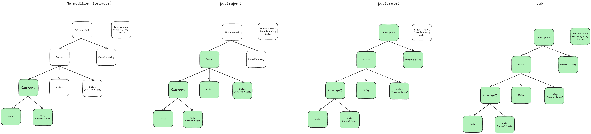

+++
date = '2025-09-08T21:51:43-07:00'
draft = false
title = 'Scope of Access Modifiers in Rust'
+++

Rust supports various access modifiers

* Private (No modifier)
* `pub(super)`
* `pub(crate)`
* `pub`

Each access modifier influences the scope of the symbol as shown below.

