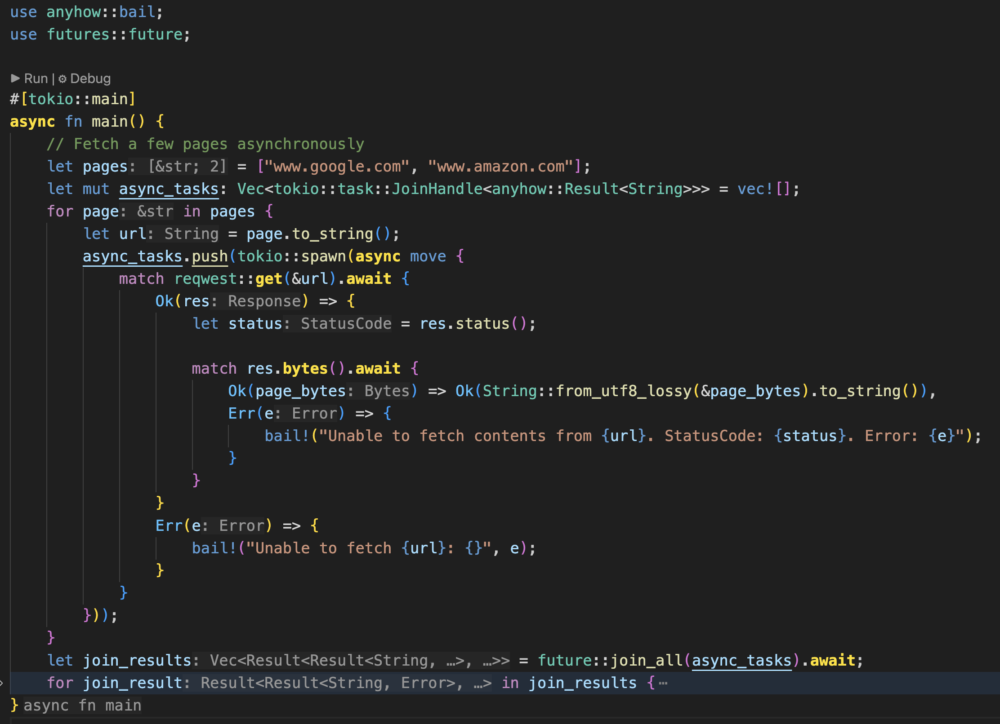

+++
date = '2025-12-19T12:29:33-08:00'
draft = false
title = 'Vscode Settings'
+++

# Highlight async/await keywords

Highlight async/await keywords using bold golden yellow.

```json
  "editor.semanticTokenColorCustomizations": {
    "rules": {
      "*.async": {
        "foreground": "#FFDF00",
        "fontStyle": "bold"
      }
    }
  },
```

Here is a demo of how this highlights all async context



# Control automatic formatting

```json
  "[rust]": {
    "editor.formatOnSave": true,
    "editor.formatOnSaveMode": "file",
    "editor.defaultFormatter": "rust-lang.rust-analyzer",
    "editor.formatOnPaste": true,
    "editor.formatOnType": true,
  },
```

# Run clippy on save

```json
  "rust-analyzer.check.overrideCommand": [
    "cargo",
    "clippy",
    "--fix",
    "--no-deps",
    "--workspace",
    "--all-targets",
    "--allow-dirty",
    "--allow-staged",
    "--allow-no-vcs"
  ],
```
